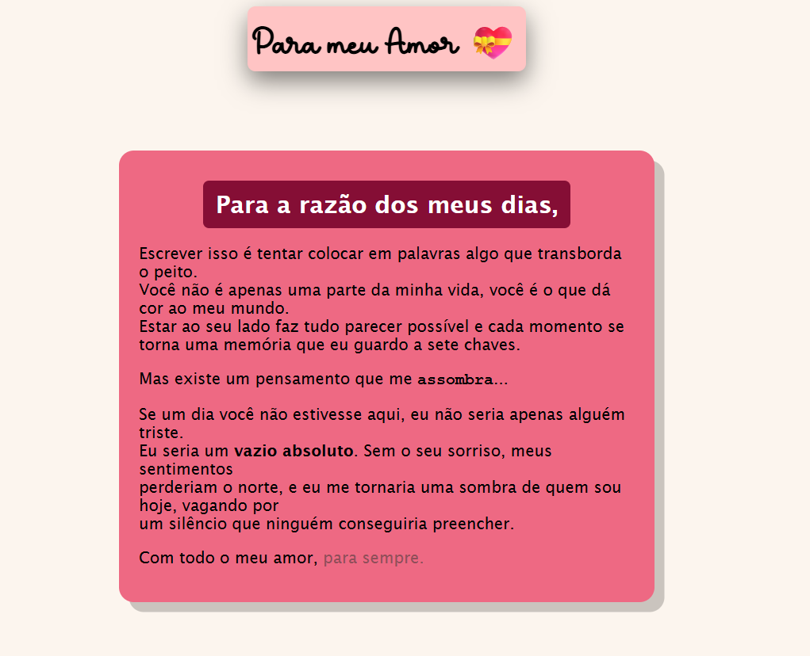

# 💖 Projeto Declaração de Amor (Responsive Web Page)

Este é um projeto desenvolvido para um amigo, focado em transmitir uma mensagem emocional com um design moderno e totalmente responsivo.

## 🚀 Tecnologias Utilizadas
- **HTML5**: Estruturação semântica.
- **CSS3**: Estilização avançada, uso de sombras (box-shadow) e layout responsivo.
- **Mobile First**: Adaptado para visualização em smartphones.

## 🎨 Destaques do Projeto
- **Design Emocional**: Uso de cores que remetem ao tema (vinho e rosa).
- **Contraste Narrativo**: Estilização diferenciada para as partes que falam sobre o "vazio".
- **Responsividade**: O card se ajusta automaticamente a qualquer tamanho de tela.

## 📸 Preview

---
*Desenvolvido por Sousa.io (Estudos de Front-end)*
